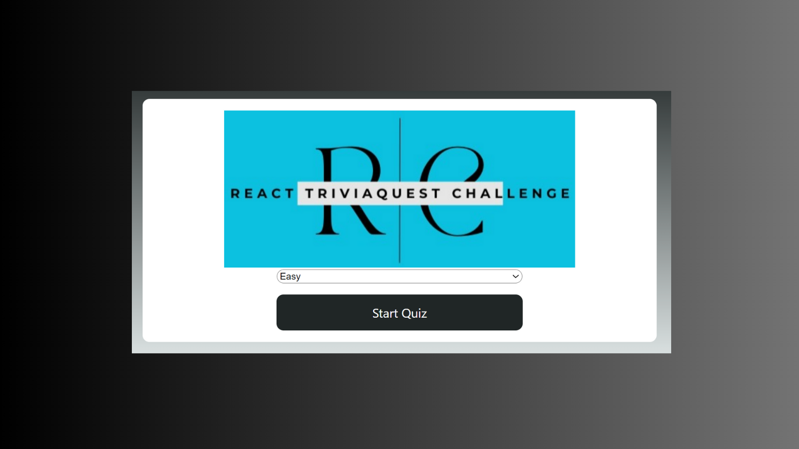

# React TriviaQuest Challenge

React TriviaQuest Challenge is an interactive trivia quiz application developed using React. This project provides users with a fun experience to test their general knowledge and information.



## Table of Contents

* Description
* Demo
* Features
* Installation
* Usage
* Contributing
* License

## Description

The React TriviaQuest Challenge is an interactive quiz application developed using React. This quiz consists of a wide range of general knowledge questions, organized into three levels of difficulty: easy, medium, and high. Users can test their knowledge by answering multiple-choice questions that gradually increase in complexity.

The quiz imposes a time limit of 30 seconds for each question. If a user fails to select an answer within the given time frame, the application automatically proceeds to the next question. At the end of the quiz, users receive their score and have the option to start a new round with fresh questions.

## Demo


## Features

* Three levels of difficulty: easy, medium, and high.
* General knowledge questions of increasing complexity.
* 30-second time limit per question.
* Automatic progression to the next question if no answer is selected.
* Score calculation and the ability to start a new round.

## Installation

1) Clone the repository to your local machine:

```
git clone https://github.com/arzucaner/react-triviaquest-challenge.git
```

2. Navigate to the project directory:

```
cd React-TriviaQuest-Challenge
```

3. Install the required dependencies:

```
npm install
```

4. Start the application:

```
npm start
```

## Usage

1. Launch the application by following the installation instructions.
2. Select your desired difficulty level (easy, medium, or high).
3. Answer the multiple-choice questions within the 30-second time limit.
4. Receive your final score at the end of the quiz.
5. Choose to start a new round to test your knowledge again.

## Contributing

I welcome and appreciate contributions from the community. If you're interested in contributing to this project, please follow these guidelines:

1. **Fork** the project repository on GitHub.
2. **Clone** your fork to your local machine.
3. Create a new **branch** for your feature or bug fix.
4. Make your changes and ensure that your code is properly formatted.
5. Write **tests** to ensure the code's integrity.
6. Commit your changes with a  **clear and descriptive message** .
7. Push your branch to your fork on GitHub.
8. Create a **pull request** to the original repository.

Thank you for helping make this project better!

## Deployment

This section has moved here: [react-triviaquest-challenge.netlify.app/](https://react-triviaquest-challenge.netlify.app/ "https://react-triviaquest-challenge.netlify.app/")

## License

This project is licensed under the MIT License.
